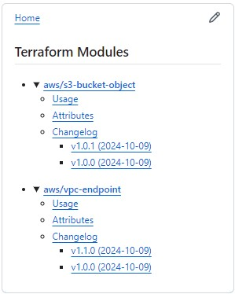
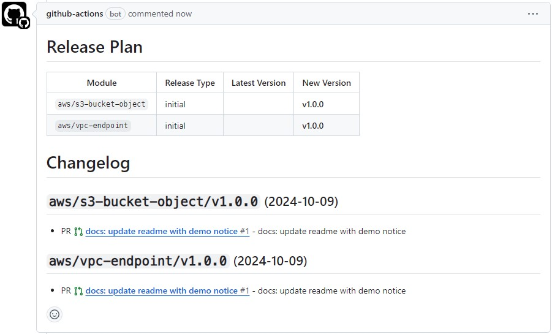
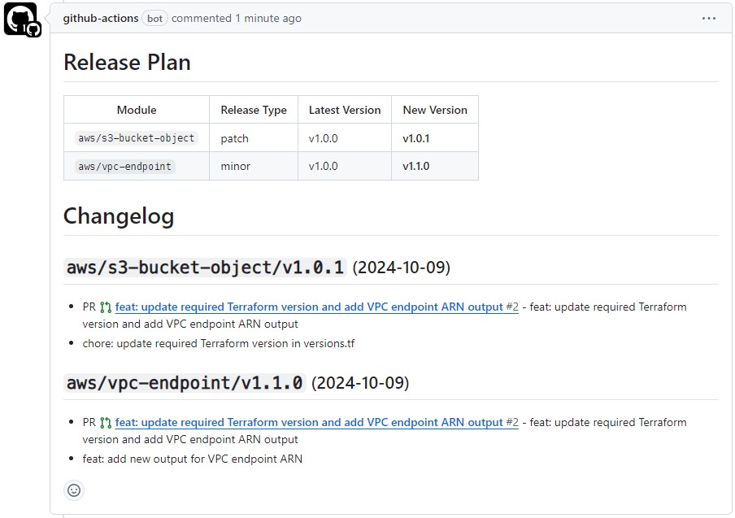
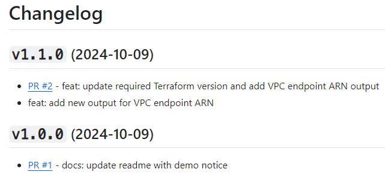
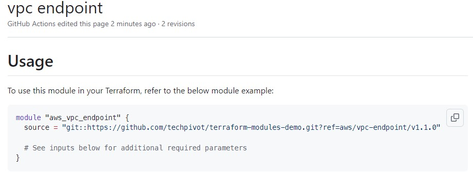
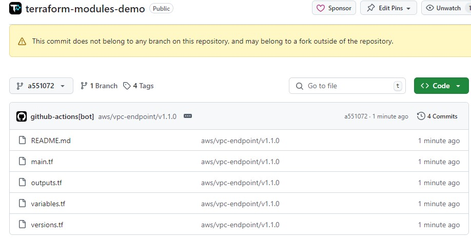
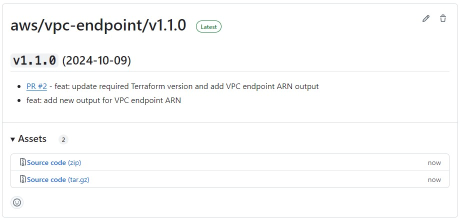
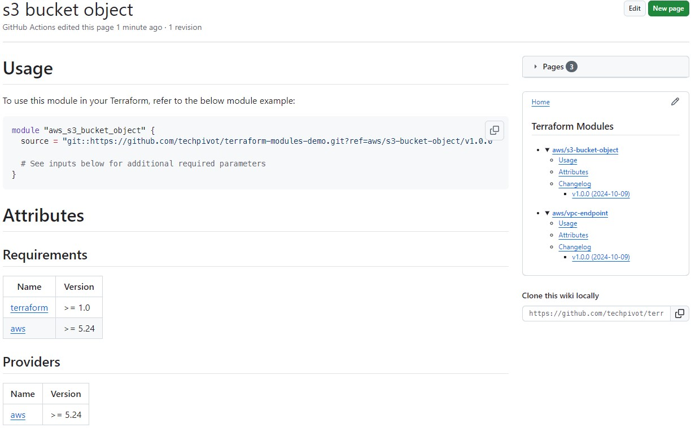

# Terraform Module Releaser

<sup><b>A GitHub Action for managing Terraform modules in GitHub monorepos, automating versioning, releases, and
documentation.</b></sup>

[][1]
[][2]

[][3]
[][4]
[][5]
[](./assets/coverage-badge.svg)

[1]: https://github.com/techpivot/terraform-module-releaser/releases/latest
[2]: https://github.com/marketplace/actions/terraform-module-releaser
[3]: https://github.com/techpivot/terraform-module-releaser/actions/workflows/lint.yml
[4]: https://github.com/techpivot/terraform-module-releaser/actions/workflows/codeql-analysis.yml
[5]: https://sonarcloud.io/summary/new_code?id=terraform-module-releaser

Simplify the management of Terraform modules in your monorepo with this **GitHub Action**. It automates module-specific
versioning and releases by creating proper Git tags and GitHub releases based on your commit messages. Each module
maintains independence while living in the same repository, with proper isolation for clean dependency management.
Additionally, the action generates a beautifully crafted wiki for each module, complete with readme information, usage
examples, Terraform-docs details, and a full changelog.

Compatible with both GitHub.com and GitHub Enterprise Server (GHES) – works seamlessly in cloud and on-premises
environments.

## 🚀 Features

- **Efficient Module Tagging** – Only includes module directory content, dramatically improving Terraform performance.
- **Smart Versioning** – Automatically determines release types (major, minor, patch) based on commit messages.
- **Comprehensive Wiki** – Generates beautiful documentation with usage examples, terraform-docs output, and full
  changelogs.
- **Release Automation** – Creates GitHub releases, pull request comments, and version tags with minimal effort.
- **Self-Maintaining** – Automatically removes tags from deleted modules, keeping your repository clean and organized.
- **100% GitHub Native** – No external dependencies or services required for modules or operation, everything stays
  within your GitHub ecosystem.
- **Zero Configuration** – Works out-of-the-box with sensible defaults for immediate productivity.
- **Flexible & Extensible** – Customizable settings to precisely match your team's specific workflow requirements.

## Demo

Check out our [Terraform Modules Demo](https://github.com/techpivot/terraform-modules-demo) repository for a practical
example of how to use this action in a monorepo setup. See real-world usage in action:

- [**Pull Request - Initial**](https://github.com/techpivot/terraform-modules-demo/pull/1)
- [**Pull Request - Module Changes**](https://github.com/techpivot/terraform-modules-demo/pull/2)
- [**Wiki**](https://github.com/techpivot/terraform-modules-demo/wiki)
- [**Releases**](https://github.com/techpivot/terraform-modules-demo/releases)
- [**_More Pull Request Examples_**](https://github.com/techpivot/terraform-modules-demo/pulls?q=is%3Apr+is%3Aclosed)

## Screenshots

<p float="left" align="center">
  
  
  
  
  
  
  
  
</p>

## Getting Started

### Step 1: Enable and Initialize GitHub Wiki

Before using this action, you'll need to enable the wiki feature for your repository:

1. Go to your repository's homepage
1. Navigate to the **Settings** tab
1. Under the **Features** section, check the **Wikis** option to enable GitHub Wiki
1. Click on the **Wiki** tab in your repository
1. Click **Create the first page** button
1. Add a simple title (like "Home") and some content
1. Click **Save Page** to initialize the wiki

> This initialization step is necessary because GitHub doesn't provide an API to programmatically enable or initialize
> the wiki.

### Step 2: Configure the Action

Add the following YAML to your `.github/workflows` directory:

#### terraform-module-releaser.yml

```yml
name: Terraform Module Releaser
on:
  pull_request:
    types: [opened, reopened, synchronize, closed] # Closed required
    branches:
      - main

permissions:
  contents: write # Required for to push tags, create release, and push changes to the wiki
  pull-requests: write # Required to comment on pull request

jobs:
  release:
    runs-on: ubuntu-latest
    steps:
      - name: Checkout code
        uses: actions/checkout@v4

      - name: Terraform Module Releaser
        uses: techpivot/terraform-module-releaser@v1
```

This configuration provides an out-of-the-box solution that should work for most projects, as the defaults are
reasonably configured.

If you need to customize additional parameters, please refer to [Input Parameters](#input-parameters) section below.

## GitHub Enterprise Server (GHES) Support

This action is fully compatible with GitHub Enterprise Server deployments:

- **Automatic Detection**: The action automatically detects when running on GHES and adjusts API endpoints accordingly
- **Wiki Generation**: Full wiki support works on GHES instances with wiki features enabled
- **Release Management**: Creates releases and tags using your GHES instance's API
- **No Additional Configuration**: Works out-of-the-box on GHES without requiring special configuration
- **SSH Source Format**: Use the use-ssh-source-format parameter for GHES environments that prefer SSH-based Git URLs

### GHES Requirements

- GitHub Enterprise Server version that supports GitHub Actions
- Wiki feature enabled on your GHES instance (contact your administrator if wikis are disabled)
- Appropriate permissions for the GitHub Actions runner to access repository features

## Permissions

Before executing the GitHub Actions workflow, ensure that you have the necessary permissions set for accessing pull
requests and creating releases.

- By default, this GitHub Action uses the
  [`GITHUB_TOKEN`](https://docs.github.com/en/actions/security-for-github-actions/security-guides/automatic-token-authentication)
  associated with the workflow. To properly comment on pull requests and create tags/releases, the workflow permission
  for `pull-requests` must be set to `"write"`.
- Additionally, the workflow permission for `contents` must also be set to `"write"` to allow the action to create tags
  and releases.
- For security considerations and best practices when using the `github_token`, please refer to the
  [Security Documentation](./security.md).
- Ensure the **Restrict editing to users in teams with push access only** setting is enabled for public repositories, as
  the GitHub Actions Bot can write to the wiki by default.

If the permissions are insufficient, the action may fail with a 403 error, indicating a lack of access to the necessary
resources.

## Directory Structure Best Practices

- Avoid placing nested Terraform modules within a sub-directory of another module, as this practice can lead to issues
  with dependency management and module separation. Instead, structure your repository with multiple levels of
  folders/directories to organize modules while keeping each Terraform module isolated within its dedicated directory.
  This approach promotes maintainability and helps ensure clarity across modules.

- We recommend structuring modules with a top-level namespace that is related to a major provider (e.g., `aws`, `azure`,
  or `null`). Within this namespace, use a nested directory to house the actual module with a name that corresponds
  closely to its intended purpose or resource. For example:

  ```shell
  ├── aws
  │   ├── vpc
  │   └── ec2
  ├── azure
  │   ├── resource-group
  │   └── storage-account
  └── null
      └── label
  ```

## Input Parameters

While the out-of-the-box defaults are suitable for most use cases, you can further customize the action's behavior by
configuring the following optional input parameters as needed.

| Input                            | Description                                                                                                                                                                                                                                                                        | Default                                                                                               |
| -------------------------------- | ---------------------------------------------------------------------------------------------------------------------------------------------------------------------------------------------------------------------------------------------------------------------------------- | ----------------------------------------------------------------------------------------------------- |
| `major-keywords`                 | Keywords in commit messages that indicate a major release                                                                                                                                                                                                                          | `major change,breaking change`                                                                        |
| `minor-keywords`                 | Keywords in commit messages that indicate a minor release                                                                                                                                                                                                                          | `feat,feature`                                                                                        |
| `patch-keywords`                 | Keywords in commit messages that indicate a patch release                                                                                                                                                                                                                          | `fix,chore,docs`                                                                                      |
| `default-first-tag`              | Specifies the default tag version                                                                                                                                                                                                                                                  | `v1.0.0`                                                                                              |
| `terraform-docs-version`         | Specifies the terraform-docs version used to generate documentation for the wiki                                                                                                                                                                                                   | `v0.19.0`                                                                                             |
| `delete-legacy-tags`             | Specifies a boolean that determines whether tags and releases from Terraform modules that have been deleted should be automatically removed                                                                                                                                        | `true`                                                                                                |
| `disable-wiki`                   | Whether to disable wiki generation for Terraform modules                                                                                                                                                                                                                           | `false`                                                                                               |
| `wiki-sidebar-changelog-max`     | An integer that specifies how many changelog entries are displayed in the sidebar per module                                                                                                                                                                                       | `5`                                                                                                   |
| `wiki-usage-template`            | A raw, multi-line string to override the default 'Usage' section in the generated wiki. Allows using variables like {{module_name}}, {{latest_tag}}, {{latest_tag_version_number}} and more.<br><sub>[Read more here](#configuring-the-wiki-usage-template)</sub>                  | [See action.yml](https://github.com/techpivot/terraform-module-releaser/blob/main/action.yml#L54-L65) |
| `disable-branding`               | Controls whether a small branding link to the action's repository is added to PR comments. Recommended to leave enabled to support OSS.                                                                                                                                            | `false`                                                                                               |
| `module-path-ignore`             | Comma-separated list of module paths to completely ignore. Modules matching any pattern here are excluded from all versioning, releases, and documentation.<br><sub>[Read more here](#understanding-the-filtering-options)</sub>                                                   | `` (empty string)                                                                                     |
| `module-change-exclude-patterns` | Comma-separated list of file patterns (relative to each module) to exclude from triggering version changes. Lets you release a module but control which files inside it do not force a version bump.<br><sub>[Read more here](#understanding-the-filtering-options)</sub>          | `.gitignore,*.md,*.tftest.hcl,tests/**`                                                               |
| `module-asset-exclude-patterns`  | A comma-separated list of file patterns to exclude when bundling a Terraform module for tag/release. Patterns follow glob syntax (e.g., `tests/\*\*`) and are relative to each Terraform module directory. Files matching these patterns will be excluded from the bundled output. | `.gitignore,*.md,*.tftest.hcl,tests/**`                                                               |
| `use-ssh-source-format`          | If enabled, all links to source code in generated Wiki documentation will use SSH format (e.g., `git::ssh://git@github.com/owner/repo.git`) instead of HTTPS format (`git::https://github.com/owner/repo.git`)                                                                     | `false`                                                                                               |
| `tag-directory-separator`        | Character used to separate directory path components in Git tags. Supports `/`, `-`, `_`, or `.`                                                                                                                                                                                   | `/`                                                                                                   |
| `use-version-prefix`             | Whether to include the 'v' prefix on version tags (e.g., v1.2.3 vs 1.2.3)                                                                                                                                                                                                          | `true`                                                                                                |

### Understanding the filtering options

- **`module-path-ignore`**: Completely ignores specified module paths. Any module whose path matches any pattern in this
  list will not be processed at all by the action. This is useful for:
  - Excluding example modules (e.g., `**/examples/**`)
  - Skipping test modules (e.g., `**/test/**`)
  - Ignoring documentation-focused modules (e.g., `**/docs/**`)
  - Excluding entire directories or paths that contain Terraform files but shouldn't be versioned as modules

  **Important pattern matching notes:**
  - Patterns are relative to the workspace directory (no leading slash)
  - A pattern like `dir/**` will match files and directories INSIDE `dir` but NOT the `dir` directory itself
  - To match both a directory and its contents, you need both patterns: `dir,dir/**`

  Example:

  ```yaml
  module-path-ignore: "**/examples/**,**/test/**,root-modules"
  ```

- **`module-change-exclude-patterns`**: These patterns determine which file changes are _ignored_ when checking if a
  module needs a new release. For example, changes to documentation, examples, or workflow files typically don't require
  a new module release.

  **Key details:**
  - Patterns are relative to each **module directory**, not the workspace root
  - Uses `matchBase: true` for pattern matching, so `*.md` will match any Markdown file in any subdirectory
  - Applied only after a module is identified but before determining if it needs a version change
  - Default patterns: `.gitignore, *.md, *.tftest.hcl, tests/**`
  - Use this for files that should be part of the module but don't affect its functionality

  **Common use cases:**
  - Documentation files (`*.md`, `docs/**`)
  - Test files (`tests/**`, `*.tftest.hcl`)
  - Examples (`examples/**`)
  - Metadata files (`.gitignore`, `.gitattributes`)

  Example:

  ```yaml
  module-change-exclude-patterns: ".gitignore,*.md,docs/**,examples/**,*.tftest.hcl,tests/**"
  ```

  > **Warning**: Avoid excluding `*.tf` files, as they are essential for module functionality and versioning.

- **`module-asset-exclude-patterns`**: When building a release asset for a module, these patterns determine which files
  are _excluded_ from the asset. This helps reduce the asset size by omitting test files, examples, documentation, etc.

  **Key details:**
  - Patterns are relative to each **module directory**, not the workspace root
  - Uses `matchBase: true` for pattern matching (same as `module-change-exclude-patterns`)
  - Applied during the bundle/archive creation phase for GitHub releases
  - Default patterns: `.gitignore, *.md, *.tftest.hcl, tests/**`
  - These patterns do NOT affect versioning decisions - only the contents of release assets

  **Common use cases:**
  - Test directories and files (`tests/**`, `*.tftest.hcl`)
  - Documentation that's not needed for module functionality (`*.md`)
  - Development-specific files (`.gitignore`, `CHANGELOG.md`)
  - Example code that shouldn't be included in the release (`examples/**`)

  Example:

  ```yaml
  module-asset-exclude-patterns: ".gitignore,*.md,examples/**,tests/**,*.tftest.hcl"
  ```

  > **Important**: Unlike `module-change-exclude-patterns`, these patterns only affect what goes into the release asset,
  > not whether a release is triggered.

All pattern matching is implemented using [minimatch](https://github.com/isaacs/minimatch), which supports glob patterns
similar to those used in `.gitignore` files. For more details on the pattern matching implementation, see our
[source code](https://github.com/techpivot/terraform-module-releaser/blob/main/src/utils/file.ts) or visit the
[minimatch documentation](https://github.com/isaacs/minimatch).

### Configuring the Wiki Usage Template

The `wiki-usage-template` input allows you to customize the "Usage" section of the generated wiki page for each module.
You can use the following dynamic variables in your template:

| Variable                        | Description                                                                                          | Example                                                         |
| ------------------------------- | ---------------------------------------------------------------------------------------------------- | --------------------------------------------------------------- |
| `{{module_name}}`               | The name of the module.                                                                              | `aws/s3-bucket`                                                 |
| `{{latest_tag}}`                | The latest Git tag for the module.                                                                   | `aws/s3-bucket/v1.2.3`                                          |
| `{{latest_tag_version_number}}` | The version number of the latest tag (Always excludes any `v` prefix)                                | `1.2.3`                                                         |
| `{{module_source}}`             | The Git source URL for the module with `git::` prefix, respecting the `use-ssh-source-format` input. | `git::ssh://github.com/techpivot/terraform-module-releaser.git` |
| `{{module_name_terraform}}`     | A Terraform-safe version of the module name (e.g., special characters replaced with underscores).    | `aws_s3_bucket`                                                 |

### Example Usage with Inputs

````yml
name: Terraform Module Releaser
on:
  pull_request:
    types: [opened, reopened, synchronize, closed] # Closed required
    branches:
      - main

permissions:
  contents: write # Required for to push tags, create release, and push changes to the wiki
  pull-requests: write # Required to comment on pull request

jobs:
  release:
    runs-on: ubuntu-latest
    steps:
      - name: Checkout code
        uses: actions/checkout@v4

      - name: Terraform Module Releaser
        uses: techpivot/terraform-module-releaser@v1
        with:
          major-keywords: major update,breaking change
          minor-keywords: feat,feature
          patch-keywords: fix,chore,docs
          default-first-tag: v1.0.0
          terraform-docs-version: v0.20.0
          delete-legacy-tags: true
          disable-wiki: false
          wiki-sidebar-changelog-max: 10
          module-path-ignore: path/to/ignore1,path/to/ignore2
          module-change-exclude-patterns: .gitignore,*.md,docs/**,examples/**,*.tftest.hcl,tests/**
          module-asset-exclude-patterns: .gitignore,*.md,*.tftest.hcl,tests/**
          use-ssh-source-format: true
          tag-directory-separator: /
          use-version-prefix: true
          wiki-usage-template: |
            This is a custom wiki usage block that supports markdown.

            The following variables are supported:
            - {{module_name}}
            - {{latest_tag}}
            - {{latest_tag_version_number}}
            - {{module_source}}
            - {{module_name_terraform}}

            ```hcl
            module "{{module_name_terraform}}" {
              source = "{{module_source}}?ref={{latest_tag}}"

              # See inputs below for additional required parameters
            }
            ```
````

## Outputs

The following outputs are available from this action:

| Output                 | Type     | Description                                                                                                |
| ---------------------- | -------- | ---------------------------------------------------------------------------------------------------------- |
| `changed-module-names` | `string` | JSON array of module names that were changed in the current pull request                                   |
| `changed-module-paths` | `string` | JSON array of file system paths to the modules that were changed                                           |
| `changed-modules-map`  | `string` | JSON object mapping module names to their change details including current tag, next tag, and release type |
| `all-module-names`     | `string` | JSON array of all module names found in the repository                                                     |
| `all-module-paths`     | `string` | JSON array of file system paths to all modules in the repository                                           |
| `all-modules-map`      | `string` | JSON object mapping all module names to their details including path, latest tag, and latest tag version   |

### Example Output Structure

```json
{
  "changed-module-names": ["aws/vpc"],
  "changed-module-paths": ["/home/runner/work/terraform-module-releaser/terraform-module-releaser/aws/vpc"],
  "changed-modules-map": {
    "aws/vpc": {
      "path": "modules/aws/vpc",
      "latestTag": "aws/vpc/v1.0.0",
      "releaseTag": "aws/vpc/v1.1.0",
      "releaseType": "minor"
    }
  },
  "all-module-names": ["aws/s3", "aws/vpc"],
  "all-module-paths": [
    "/home/runner/work/terraform-module-releaser/terraform-module-releaser/aws/s3",
    "/home/runner/work/terraform-module-releaser/terraform-module-releaser/aws/vpc"
  ],
  "all-modules-map": {
    "aws/s3": {
      "path": "modules/aws/s3",
      "latestTag": "aws/s3/v2.1.0",
      "latestTagVersion": "v2.1.0"
    },
    "aws/vpc": {
      "path": "modules/aws/vpc",
      "latestTag": "aws/vpc/v1.0.0",
      "latestTagVersion": "v1.0.0"
    }
  }
}
```

## Inspiration

This action was inspired by the blog post
[GitHub-Powered Terraform Modules Monorepo](https://cloudchronicles.blog/blog/GitHub-Powered-Terraform-Modules-Monorepo/)
by Piotr Krukowski.

## Notes

- This action uses [Conventional Commits](https://www.conventionalcommits.org/) to automatically determine the release
  type _(major, minor, or patch)_ based on commit messages. This behavior is configurable via
  [inputs](#input-parameters).
- Versioning is done using [Semantic Versioning (SemVer)](https://semver.org/), which provides a clear and consistent
  way to manage module versions.
- Commit messages are linked to the respective Terraform directories _(handling PRs that may have separate modules and
  changed files)_.
- Unlike the original inspiration, which relied on labels for tagging and versioning, this action leverages commit
  messages to determine the release type. This approach simplifies the process and eliminates the complexity introduced
  by labels, which were PR-specific and didn't account for individual commits per module. By using commit messages, we
  can now accurately tag and version only the relevant commits, providing a more precise and efficient release
  management process.
- **100% GitHub-based**: This action has no external dependencies, eliminating the need for additional authentication
  and complexity. Unlike earlier variations that stored built module assets in external services like Amazon S3, this
  action keeps everything within GitHub, providing a self-contained and streamlined solution for managing Terraform
  modules. Works seamlessly with both GitHub.com and GitHub Enterprise Server environments.
- **Pull Request-based workflow**: This action runs on the pull_request event, using pull request comments to track
  permanent releases tied to commits. This method ensures persistence, unlike Action Artifacts, which expire. As a
  result, the module does not support non-PR workflows, such as direct pushes to the default branch.

## License

The scripts and documentation in this project are released under the [MIT License](./LICENSE.md).

## Security

For detailed information about security practices and guidelines, check out the [Security Documentation](./security.md).
